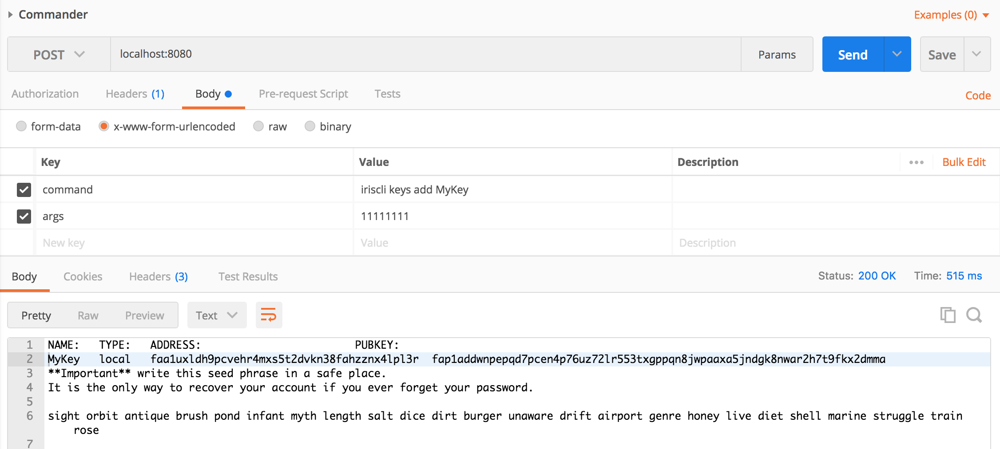

# Commander
提供一个Restful API，通过Post请求发送命令在宿主机上执行，并返回执行结果 

**注意：只用于测试环境，禁止在生产环境服务器部署**

## 安装

```$shell
git clone https://gitlab.bianjie.ai/bianjieai/commander.git
cd commander
dep ensure
go install
```

## 运行

```$shell
commander
```

## 调用

